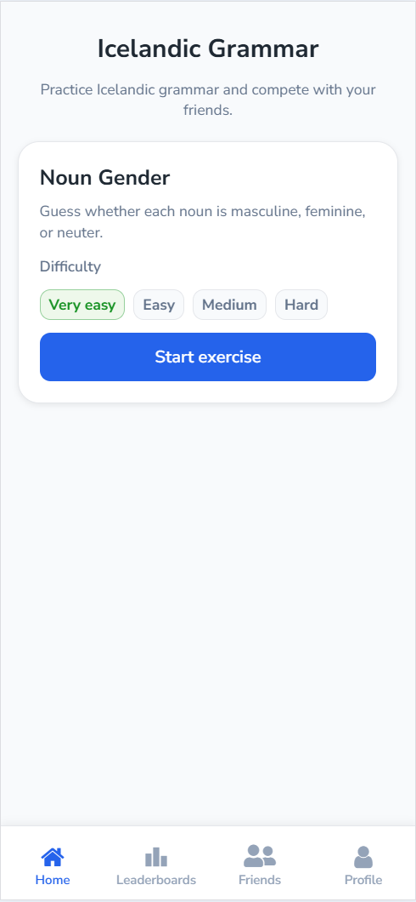
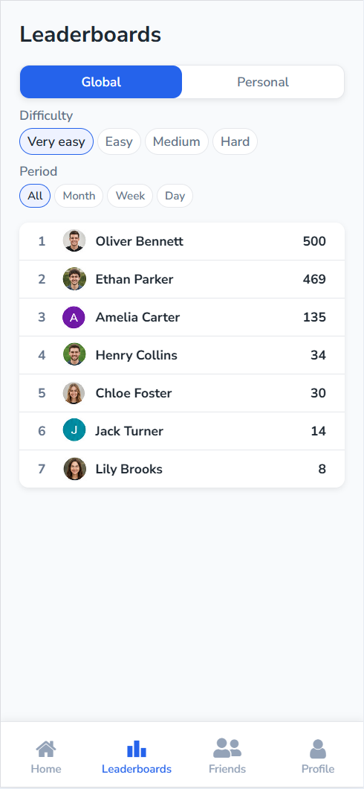
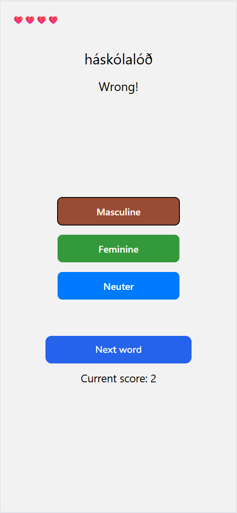

# Icelandic Grammar

A full-stack learning app for practising Icelandic noun gender through
data-driven exercises, score tracking and social features.

Built with React Native, Expo, TypeScript, Supabase and PostgreSQL.

[Open the live demo](https://icelandic-grammar.netlify.app/)

<p align="center">  </p>

## About the project

Icelandic nouns have three grammatical genders, and the correct gender is
not always obvious to learners.

The application turns noun-gender practice into short game sessions with
several difficulty levels, immediate feedback, score history and optional
social competition.

## Features

### Learning and gameplay

- Four difficulty levels
- Data-driven word selection
- A dataset of more than 30,000 Icelandic nouns
- Immediate answer feedback
- Lives, scoring and completed game sessions
- Personal score history

### Social features

- Global leaderboards
- Difficulty and time-period filters
- User profiles and avatars
- Friend search and friend requests

## Technical overview

### Data-driven difficulty

Words are selected based on their frequency in Icelandic and the statistical
predictability of their endings.

### Server-side game logic

Game sessions, lives, scores and answer history are stored in PostgreSQL.
Core game operations are implemented with PostgreSQL functions exposed
through Supabase RPC.

### Relational social system

Friend relationships and requests are modelled in PostgreSQL and exposed
through dedicated views for incoming requests, outgoing requests and
accepted friendships.

### Authentication and access control

User authentication is handled through Supabase Auth. Database access is
restricted with Row Level Security so that user-specific data is protected
at the database level.

## Technology

| Part           | Technology                            |
| -------------- | ------------------------------------- |
| Application    | React Native, React, Expo             |
| Language       | TypeScript                            |
| Navigation     | Expo Router                           |
| Backend        | Supabase, RPC functions               |
| Database       | PostgreSQL                            |
| Authentication | Supabase Auth                         |
| Deployment     | Netlify                               |
| Styling        | React Native StyleSheet, shared theme |

## Architecture

```text
React Native / Expo application
        │
        ├── Expo Router navigation
        ├── Supabase Authentication
        └── Supabase client
                  │
                  ├── PostgreSQL tables and views
                  ├── Row Level Security
                  └── RPC functions for game and social logic
```

## Project status

The application is under active development. The noun-gender exercise,
score history, global leaderboards, profiles and friend management are
currently implemented.

The web version is available as a live demo. Native Android and iOS releases
are planned for a later stage.

## Roadmap

- Resume unfinished game sessions
- Friends leaderboard
- Score visibility controls and anonymous leaderboard entries
- Profile settings
- Icelandic-language interface
- Overview of common noun endings by gender
- Game-session statistics
- Achievements
- Native Android and iOS builds

## Running locally

### Requirements

- Node.js
- npm
- A Supabase project

### Installation

1. Clone the repository.
2. Install the dependencies with `npm install`.
3. Copy `.env.example` to `.env` and add your Supabase project values.
4. Start the web application with `npm run web`.

## Author
Developed by Simon Hilmarsson.

- GitHub: [simonvidar](https://github.com/simonvidar)
- LinkedIn: [Simon Hilmarsson](https://www.linkedin.com/in/simonhilmarsson)